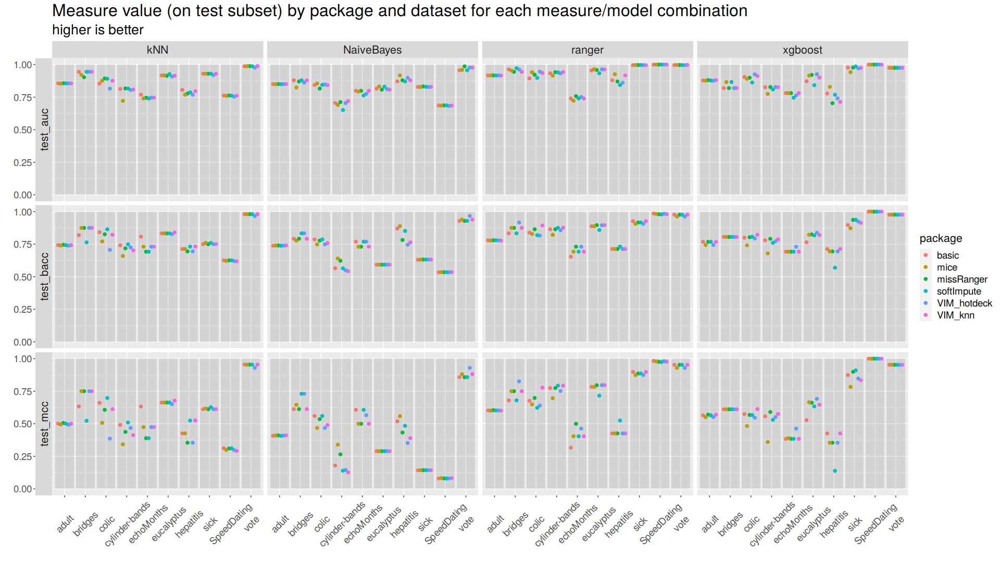
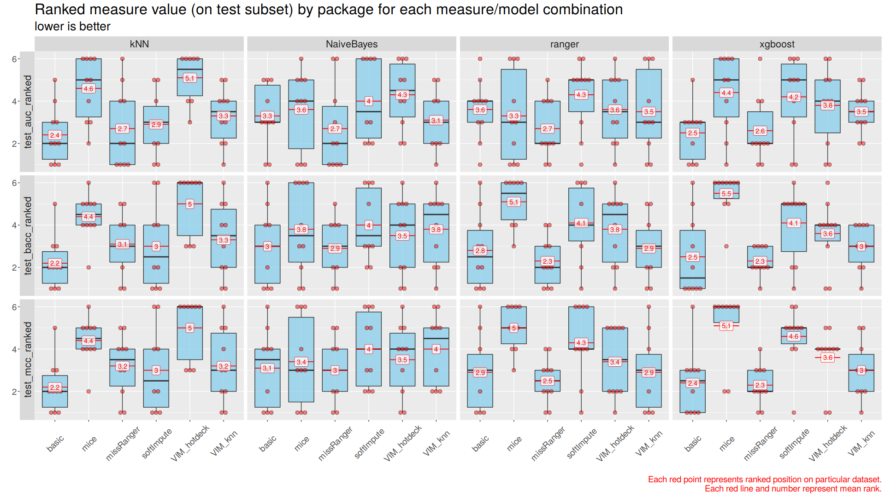
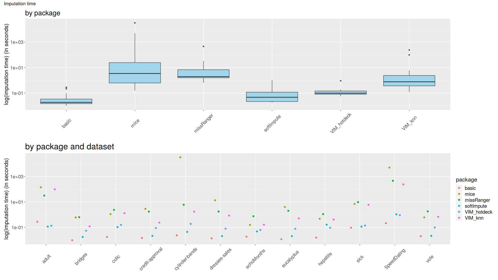

## Abstract  

[comment]: # (Jeszcze jest stary abstrakt, ale to chyba na koniec ppr)

It is very common for datasets to contain incomplete observations. The analysis conducted by ignoring cases with missing data and considering only complete observations is perceived as naive, inefficient and exposed to bias, as missing values may also convey valuable information. To incorporate these sketchy observations, various methods of handling missing data may be considered, including both less and more sophisticated approaches.  It turns out that the performance of machine learning classification models moderately depends on the type of approach that is applied to the imputation problem while the time of imputation, when using different techniques, is highly diverse. We considered 10 data sets, 6 imputation methods and 4 classifiers in the study. Presented article focuses on one basic technique (median/mode imputation) and five more sophisticated ones, which origin respectively from: mice, VIM, missRanger and softImpute R packages. For testing purposes as the classification algorithms used are RangerForest, XGBoost, K Nearest Neighbors and Naive Bayes. To aggregate algorithm's results with respect to each imputation, ranking measures of imputation methods were created.   
The actual differences in prediction accuracy in general are slight. In the ranking for the Naive Bayes, XGBoost and Ranger Forest algorithms the missRanger method turned out to be the best, while for the kNN classifier the base one.  As for the time of imputation, it highly depends on the technique complexity, so the basic method turns out to be the fastest one. However the hotdeck method from the VIM package is also noteworthy, as it performs only slightly longer.    
The analysis shows that selecting the best method or the best combination of methods that will work globally for each problem is extremely difficult, because a lot depends on the structure of the set, the nature of the considerations and the amount of time we have.

## Introduction

Dealing with missing data is a substantial part of feature engineering as most of the machine learning algorithms do not accept incomplete datasets. Data imputation, which is replacing missing values with a value based on other available cases, is the solution for that problem. However, despite the acknowledged importance of it, in many practical cases it is not handled with proper caution. Basic median/mode imputation is often used, as well as deleting rows with missing data (if the number of missing values is low). 

As there are many different imputation techniques, choosing which one to use is complicated. There are no objective rules to follow, the only way to choose the best one is checking every one of them. The purpose of our experiment is to find best ways to impute data while using specific algorithms. The differences in the results of the classification algorithm for the imputation techniques in respect to included measures are 

This paper introduces imputation techniques in the context of their impact on the the time of filling missing data and the prediction efficiency of four classification algorithms (k nearest neighbours, naive bayes, XGBoost and Ranger Random Forest).

## Methodology

All of the algorithms we used for tests, do not accept missing values. To find the best way to handle missing data for each algorithm we decided to perform an experiment. We used six different imputation functions on each one of the 10 benchmarking datasets:

[comment1]: # (Poprawić na końcową liczbę zbiorów!)

* **basic method** using impute() function from imputeMissings package. It imputes missing numeric values with median and categorical variables with mode of other records.
* **mice()** function from mice package. The function uses Predictive Mean Matching to impute missing values.
* **missRanger()** function from missRanger package. The technique uses the ranger package to do fast missing value imputation by chained random forest.
* **hotdeck()** function from VIM package. Each missing value is replaced with an observed response from a “similar” unit.
* **kNN()** function from VIM package. It finds the k closest neighbors to the observation with missing data and then imputes them based on the the non-missing values from its neighbors.
* **softImpute()** function combined with mode imputation}. The first method origins from softImpute package and is applied to impute numeric variables. Mode imputation is used for categorical ones imputation. 

Function using imputeFAMD() from missMDA package was also created but it was unable to perform imputation on all of benchmarking datasets due to issues with convergence. Imputation with use of Amelia package also proved impossible due to occurrence of highly correlated variables in some benchmarking datasets.

To automatize our work we created specialized functions: **split_and_impute()** and  **train_and_test()**. 

  
* The first function divides given dataset into train and test sets (of given size) and imputes it with specified imputer. If we set the "save" argument to TRUE it saves the imputed datasets. It returns imputed train and test sets and the time of imputation. 

  
  
* The second function performs crossvalidation on train set (The default number of folds is 5, but it can by changed) and makes the predictions for test set made with specified learnner, trained on the whole train set (target variable, and name of the positive class is given by the user). Based on mentioned results it calculates AUC, BACC and MCC measures for both crossvalidation and test set testing stages. It also returns plots of ROC curve,AUC, BACC and MCC measures achieved during crossvalidation stage. 

After calling split_and_impute() and test_and_train() functions on each dataset with six different imputers and with four different algorithms we were able to compare performance of each tested imputation function in the context of its impact on the prediction efficiency of the classification alghoritms.

The prediction effectiveness for each alghoritm  was assessed in relation to the area under the ROC curve (AUC[^1]), , balanced accuracy (BACC[^2]), and Matthews correlation coefficient (MCC[^3]) measures. Time of each imputation was also measured, and taken into consideration.

## Results

Each imputation function was performed on ten benchmarking datasets with missing data, divided into test and train sets. We gathered the predictions for test sets from ranger Random Forest, kNN, Naive Bayes, and XGBoost models fitted on train sets. points). For each of the used measures (AUC, BACC and MCC) and for each classification algorithm we created a ranking. The method gets 1 point if it gives the best result on a dataset, and 6 points if it is the worst one. We created a boxplot for each method. (See Figure 1) . We also created a scatter plot where for each dataset, the results of each imputation method can be compared (see Figure 2). The time of imputation was also measured. (See Figure 3).

It should be mentioned that any differences in results are only due to a change in the imputation technique. Each of them was performed on the same sets with identical divisions into train and test sets. So even small differences should be taken into consideration. It is also important that we took into consideration only datasets on which all of the imputation methods work, so that all of them may be compared fairly.

## Conclusions

After analysing the results (and the plots) it became obvious that it is not possible to pick the best imputation method for all alghoritms. Therefore we decided to pick the best one for each alghoritm separately. For K nearest neighbours classifier the best AUC, BACC and MCC scores were gained for basic median/mode imputer. For three other alghoritms (Naive Bayes, XGBoost and Ranger Random Forest) the missRanger imputation turned out to be the best one, but the basic median/mode imputer was second in most of the rankings. It was also the quickest one as it is shown on Plot3. 
The imputer that turned out to be one of the worst and also the slowest was mice. So in conclusion if time of imputation is important in our 
project, it is a good idea to consider using basic median/mode imputer, however if we have some time ane use for example XGBoost, missRanger seems to be the best option. 

[^1]: Flach Peter, Hernandez-Orallo Jose, Ferri, Cèsar "A Coherent Interpretation of AUC as a Measure of Aggregated Classification Performance."Proceedings of the 28th International Conference on Machine Learning, ICML 2011
[^2]: Velez, D.R., White, B.C., Motsinger, A.A., Bush, W.S., Ritchie, M.D., Williams, S.M. and Moore, J.H. (2007), A balanced accuracy function for epistasis modeling in imbalanced datasets using multifactor dimensionality reduction. Genet. Epidemiol., 31: 306-315. DOI: 10.1002/gepi.20211
[^3]:Boughorbel, S., Jarray, F., & El-Anbari, M. (2017). Optimal classifier for imbalanced data using Matthews Correlation Coefficient metric. PloS one, 12(6), e0177678. DOI: https://doi.org/10.1371/journal.pone.0177678

